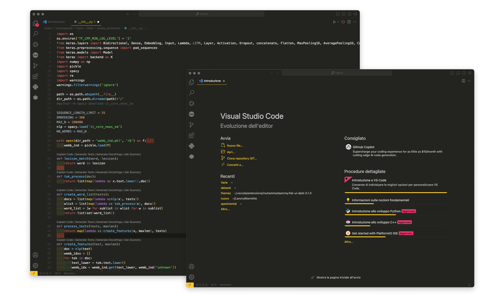

# pirate-flat README

## There's not much to write, it's a damn VSC theme, so there's nothing to write about, you should try it.




```bash
cd .vscode/extensions/ && git clone https://github.com/Pinperepette/pirate-flat
```

## Contributing

If you wish to contribute to this project, you can start by exploring the themes we're using in our code. We've utilized Visual Studio Code theme colors to maintain a consistent look. You can find more details about the color syntax in the [Visual Studio Code Theme Color Reference](https://code.visualstudio.com/api/references/theme-color).


